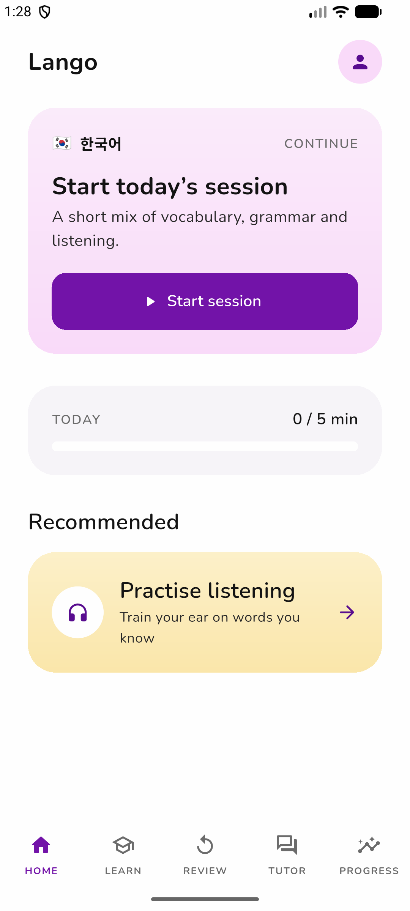
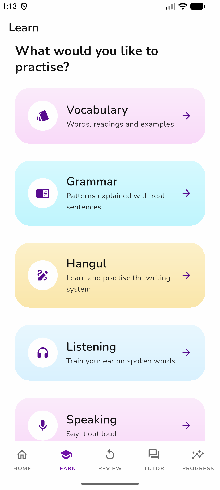
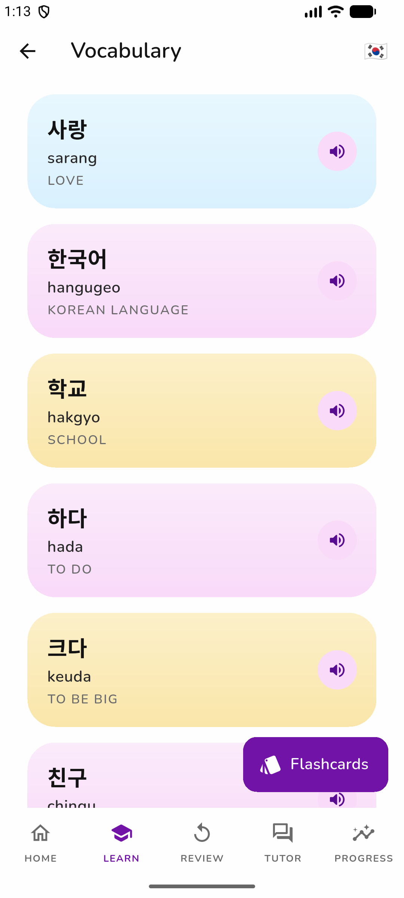
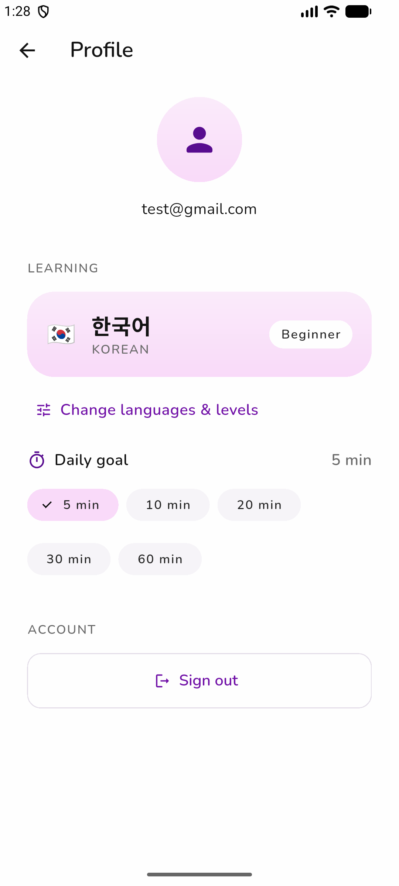

# Lango — Korean + Japanese Learning App

A mobile-first Flutter app for learning Korean and Japanese together, backed by
Supabase (auth + Postgres with row-level security).

Korean and Japanese are first-class throughout: every language appears in its
own script (한국어 / 日本語), native words are always the largest element on
screen, and each script renders in a bundled font so it looks identical on
every device.

## Screenshots

| Home | Learn |
| --- | --- |
|  |  |

| Vocabulary | Profile |
| --- | --- |
|  |  |

## What's implemented

- **Auth** — email/password signup, sign in, sign out (Supabase Auth)
- **Onboarding** — pick Korean/Japanese (or both), per-language level, goals, daily goal
- **Home** — tells you the one thing to do next: due reviews, or today's session
- **Vocabulary** — paginated browser, detail sheets, flashcards, pronunciation
- **Exercises** — multiple choice, reverse translation, type-the-answer, sentence completion
- **Spaced repetition** — deterministic SM-2 variant (`lib/services/srs/srs_engine.dart`),
  append-only `review_events` log, due queue across vocabulary/grammar/characters
- **Grammar** — lessons with real example sentences, plus practice quizzes
- **Writing** — Hangul, Hiragana, Katakana with a trace-over practice canvas
- **Listening** — listen → choose-the-meaning exercises
- **Progress** — study time, items reviewed, accuracy, streak and a skill map,
  all derived from recorded activity
- **Daily session** — guided review → learn → practise → listen loop, persisted
- **Dictation** — type what you hear, with a token-level diff of what differed
- **Speaking** — record a sentence with the device's own recogniser and see
  which words came through (see the caveat below)
- **AI Tutor** — scenario conversations with corrections, backed by a Supabase
  Edge Function that holds the model key server-side
- **Kanji** — readings, meanings, JLPT level and real example vocabulary
- **Search** — one field across words, grammar and characters, in native
  script, romanization or English
- **Compare** — the same idea in each language you study, side by side, with
  how close the match actually is
- **Weak areas & recommendations** — what you are measurably getting wrong, and
  one suggested next activity with the reason for it
- **History** — sessions, reviews, exercises, speaking attempts and study time
  by day

### What we deliberately don't do

**Speaking is speech recognition, not pronunciation scoring.** The app compares
the device's transcript against the target sentence and shows missing, extra
and replaced words plus the recogniser's confidence *in its own transcript*. A
mismatch can mean you said something different or that the recogniser misheard
you, and nothing available here can tell those apart — so no pronunciation
percentage is shown.

**The AI Tutor needs a deployed backend.** Until the `tutor` Edge Function is
deployed with a model API key, the Tutor screen says so and the scenarios stay
inactive. It never fakes a conversation.

**Stroke order and unverified stroke counts are not shown.** A character
displays a stroke count only when the record has one.

### Speech

Pronunciation audio comes from **NVIDIA MagpieTTS Multilingual 357M**, running
in `services/tts/` — one model for all three languages the app teaches. The
model needs a GPU, so it is a separate deployable rather than something inside
Flutter or a Supabase Edge Function. The app posts text and gets back a signed
URL to an mp3; generated clips are cached in Supabase Storage, so the same
sentence is synthesized once and then served from storage forever.

If `TTS_API_BASE_URL` is unset — or the service is unreachable — the app falls
back to the on-device platform voice. Different voice, but better than silence
mid-lesson.

## Setup

### 1. Supabase

1. Create a project at [supabase.com](https://supabase.com).
2. In the SQL editor, run, in order:
   - `supabase/migrations/0001_initial_schema.sql`
   - `supabase/migrations/0002_p1_p2.sql`
   - `supabase/seed.sql`
   (or use the CLI: `supabase link && supabase db push`, then run the seed)
3. For fastest local dev, disable **email confirmations** under
   Authentication → Providers → Email. The app handles both modes.
4. Copy the project URL and the anon/publishable key from Project Settings → API.

### 2. Run the app

```sh
flutter pub get
flutter run \
  --dart-define=SUPABASE_URL=https://YOUR-PROJECT.supabase.co \
  --dart-define=SUPABASE_ANON_KEY=YOUR-PUBLISHABLE-KEY
```

Speaking practice asks for microphone and speech-recognition permission the
first time you open it. Both are declared in `ios/Runner/Info.plist` and
`android/app/src/main/AndroidManifest.xml`; recognition runs on the device.

`lib/core/env.dart` carries a default project URL and publishable key so the
app runs with a bare `flutter run`. A publishable/anon key is meant to be
shipped in a client — access is enforced by row-level security, not by hiding
it — but override both values with `--dart-define` to point at your own
project. **Never** put a `service_role` key in this file.

### 3. AI tutor (optional)

The tutor is a Supabase Edge Function so the model API key never ships inside
the client. Without it the app still runs — the Tutor screen reports that no
tutor is connected.

```sh
supabase secrets set ANTHROPIC_API_KEY=sk-ant-...
supabase functions deploy tutor
```

The function is in `supabase/functions/tutor/index.ts`. It receives the
learner's level, goals, studied vocabulary and grammar, and recent mistakes,
and returns a reply plus an optional correction in a fixed JSON shape.

### 4. Speech synthesis (optional)

Audio works without this: leave `TTS_API_BASE_URL` unset and the app uses the
on-device voice. To run the real model, deploy `services/tts/` on a GPU host
and point the app at it:

```sh
flutter run --dart-define=TTS_API_BASE_URL=https://tts.example.com
```

`services/tts/README.md` covers local development, Docker, GPU requirements,
Supabase Storage setup, monitoring and where to host it.

### 5. Tests

```sh
flutter analyze
flutter test
```

The Flutter suite covers the four pure engines: the SRS scheduler (determinism, intervals,
mastery, failure resets), the exercise generator (reproducibility, answer
checking), the speech/dictation comparison (tokenization across spaced and
unspaced scripts, missing vs extra vs replaced words), and the recommendation
engine (priority order, evidence thresholds, available study time), plus the
TTS API client (request shape, auth header, every failure mode).

The TTS service has its own suite:

```sh
cd services/tts && pytest        # 60 tests, no GPU needed
cd services/tts && pytest -m gpu # real model; needs CUDA
```

## Architecture

```
lib/
├── core/
│   ├── design/    design tokens — colour, type, spacing, radius, motion
│   └── theme.dart ThemeData built from those tokens
├── models/        language, content, profile, user_item (SRS state)
├── services/      auth, profile, content, review, session, progress, search,
│   │               insights, history, comparison, speech, speaking, tutor, TTS
│   ├── srs/       pure scheduling engine — no I/O, fully tested
│   ├── speech/    pure transcript comparison — fully tested
│   ├── recommend/ pure recommendation engine — fully tested
│   └── exercises/ pure exercise generator + dictation grading — fully tested
├── widgets/       shared UI — cards, states, native text, audio, ratings
│   └── tts/       remote TTS client + strict language enum
└── features/      one folder per screen area
    └── shell/     persistent navigation (Home · Learn · Review · Tutor · Progress)

services/
└── tts/           FastAPI + MagpieTTS inference service (GPU, deployed separately)
```

### Design system

Every colour, space, radius and text style comes from
`lib/core/design/tokens.dart` and `typography.dart` — no screen hardcodes a
hex value or a magic number. Notable rules:

- **Flat depth.** No shadows, no elevation, no card borders. Surfaces separate
  by pastel tint (a subtle top-to-bottom gradient), not by edges.
- **Cards are rounder than buttons** — 28 vs 14 radius.
- **Native-first hierarchy.** The Korean or Japanese word is the largest thing
  on its surface; the English gloss sits beneath it, small, uppercase, tracked.
- **Bundled CJK fonts.** Nunito for Latin, Noto Sans KR for Hangul, Noto Sans
  JP for Kana/Kanji — subset and instantiated to static weights
  (`assets/fonts`, ~8 MB). Without these, Korean and Japanese fall back to
  different platform fonts on Android and iOS.
- **Light theme only.** The tokens are structured so a dark theme can be added
  later without touching a single widget.

`UI_AUDIT.md` and `REFERENCE_ANALYSIS.md` document the pre-redesign state and
the measured design tokens.

### Key invariants

- `review_events` is append-only; RLS has no update or delete policy, so
  history can't be silently rewritten. Progress is derived from it.
- Scheduling is pure and isolated (`SrsEngine`) so the algorithm can evolve
  (FSRS etc.) without touching UI or persistence.
- Languages are rows in a `languages` table — a third language is data, not a
  migration.
- Screens never call Supabase directly; all access goes through `lib/services/`.
- Nothing claims accuracy the system can't measure. Where a metric isn't
  available it renders as "—", not as zero.
- No model API key ever reaches the client. The tutor runs in a Supabase Edge
  Function and speech synthesis in `services/tts/`; the app authenticates to
  both with the learner's own Supabase token.
- `vocabulary.audio_url` still exists so recorded native audio can replace
  synthesis for individual words without code changes.

### Where the model runs

The only language-model call in the product is the tutor turn, and it happens
in `supabase/functions/tutor/index.ts` — never in the client. The function is
handed the learner's recorded state (level, goals, studied items, recent
mistakes) and returns a structured reply, so the app never has to parse a
correction out of prose.

## Roadmap

Recorded native audio for high-frequency words, Kanji beyond the bundled JLPT N5 set,
handwriting recognition for the writing canvas, and UI languages beyond
English.

## Licence

Bundled fonts are SIL Open Font License 1.1 — see
[`assets/fonts/LICENSE.md`](assets/fonts/LICENSE.md) for attribution and the
full licence text.
